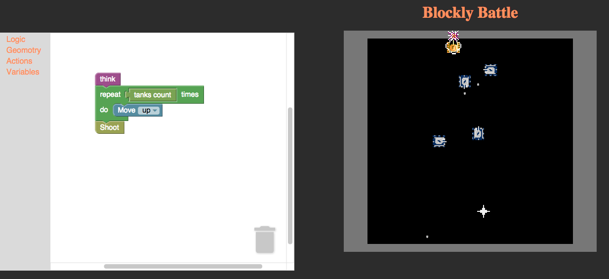

# Blockly Battle

## Description

This is a fork of juleswang's [BattleCity.AI](https://github.com/alg/battlefield) repo. This is a classic tank game with AI bots. We have tweaked the game such that player could control his tank using blockly besides keyboard control.

## Screenshots

Here are a couple screenshots of out project.

## APIs used

1. Blockly
